# Objetivos, principios y dominio de la seguridad en sistemas operativos

Cuando hablamos de los principios, fundamentos y dominio de la seguridad en el contexto de los sistemas operativos, nos referimos específicamente a las medidas y mecanismos implementados para proteger el sistema operativo en sí y los recursos que gestiona, como la memoria, los archivos, los dispositivos y la red, contra accesos no autorizados, modificaciones, destrucción o interferencias. No estamos hablando de la seguridad del usuario final, aunque ambos conceptos están relacionados.

La seguridad en sistemas operativos se centra en garantizar que el sistema funcione de manera segura y eficiente, protegiendo los datos y recursos contra accesos no autorizados, modificaciones maliciosas y ataques. Esto incluye la implementación de controles de acceso, políticas de protección y mecanismos de auditoría.

Por otro lado, la seguridad del usuario final se refiere a las prácticas y medidas que los usuarios deben seguir para proteger su información personal y sus dispositivos. Esto incluye el uso de contraseñas seguras, la instalación de software antivirus y la adopción de buenas prácticas de navegación en Internet.

## Timeline de la Seguridad en Sistemas Operativos

```mermaid
timeline
    title Línea de Tiempo de la Seguridad en Sistemas Operativos
    section Década de 1960
        1965 : Multics introduce el modelo de anillos de protección.
        1969 : Unix implementa permisos básicos, sentando las bases del DAC.
    section Década de 1970
        1972 : El informe de Anderson establece los principios básicos de diseño seguro.
        1973 : Bell-LaPadula presenta un modelo formal para el MAC.
        1975 : Saltzer y Schroeder introducen los principios de diseño seguro.
    section Década de 1980
        1983 : Introducción del Orange Book por el Departamento de Defensa de EE. UU.
        1985 : Windows NT desarrolla listas de control de acceso (ACL) detalladas.
        1987 : Primeras implementaciones de firewalls para proteger redes conectadas a Internet.
    section Década de 1990
        1990 : Kerberos asegura sistemas en red mediante claves criptográficas.
        1993 : Linux introduce permisos de archivos y seguridad similar a Unix.
        1998 : SELinux comienza su desarrollo, integrando MAC en el kernel de Linux.
    section Década de 2000
        2001 : Microsoft lanza Windows XP con firewall y actualizaciones automáticas.
        2004 : SELinux se integra oficialmente en el kernel de Linux.
        2007 : Virtualización como estrategia de protección con VMware y Xen.
    section Década de 2010
        2010 : Sandboxes en iOS y Android para aislar aplicaciones.
        2013 : Docker introduce contenedores con aislamiento de procesos.
        2015 : Windows 10 incorpora Windows Defender y protección en la nube.
    section Década de 2020
        2020 : Uso extendido de Zero Trust Architecture (ZTA).
        2021 : Confidential Computing protege datos durante el procesamiento.
        2023 : Avances en IA para detección y respuesta a amenazas en tiempo real.
```
