# Objetivos, principios y dominio de la seguridad en sistemas operativos

Cuando hablamos de los principios, fundamentos y dominio de la seguridad en el contexto de los sistemas operativos, nos referimos específicamente a las medidas y mecanismos implementados para proteger el sistema operativo en sí y los recursos que gestiona, como la memoria, los archivos, los dispositivos y la red, contra accesos no autorizados, modificaciones, destrucción o interferencias. No estamos hablando de la seguridad del usuario final, aunque ambos conceptos están relacionados.

La seguridad en sistemas operativos se centra en garantizar que el sistema funcione de manera segura y eficiente, protegiendo los datos y recursos contra accesos no autorizados, modificaciones maliciosas y ataques. Esto incluye la implementación de controles de acceso, políticas de protección y mecanismos de auditoría.

Por otro lado, la seguridad del usuario final se refiere a las prácticas y medidas que los usuarios deben seguir para proteger su información personal y sus dispositivos. Esto incluye el uso de contraseñas seguras, la instalación de software antivirus y la adopción de buenas prácticas de navegación en Internet.

## Evolucion de los objetivos de la Seguridad en Sistemas Operativos

```mermaid
timeline
    title Línea de Tiempo de la Seguridad en Sistemas Operativos
    section Fundamentos de la Protección
        1965 : Multics introduce el modelo de anillos de protección.
        1969 : Unix implementa permisos básicos, sentando las bases del DAC.
    section Teoría y Modelos Formales
        1972 : El informe de Anderson establece los principios básicos de diseño seguro.
        1973 : Bell-LaPadula presenta un modelo formal para el MAC.
        1975 : Saltzer y Schroeder introducen los principios de diseño seguro.
    section Seguridad en Sistemas Distribuidos
        1983 : Introducción del Orange Book por el Departamento de Defensa de EE. UU.
        1985 : Windows NT desarrolla listas de control de acceso (ACL) detalladas.
        1987 : Primeras implementaciones de firewalls para proteger redes conectadas a Internet.
    section Expansión de la Conectividad
        1990 : Kerberos asegura sistemas en red mediante claves criptográficas.
        1993 : Linux introduce permisos de archivos y seguridad similar a Unix.
        1998 : SELinux comienza su desarrollo, integrando MAC en el kernel de Linux.
    section Seguridad contra Ataques Avanzados
        2001 : Microsoft lanza Windows XP con firewall y actualizaciones automáticas.
        2004 : SELinux se integra oficialmente en el kernel de Linux.
        2007 : Virtualización como estrategia de protección con VMware y Xen.
    section Protección en Sistemas Móviles y en la Nube
        2010 : Sandboxes en iOS y Android para aislar aplicaciones.
        2013 : Docker introduce contenedores con aislamiento de procesos.
        2015 : Windows 10 incorpora Windows Defender y protección en la nube.
    section  Inteligencia Artificial y Sistemas Descentralizados
        2020 : Uso extendido de Zero Trust Architecture (ZTA).
        2021 : Confidential Computing protege datos durante el procesamiento.
        2023 : Avances en IA para detección y respuesta a amenazas en tiempo real.
```

### Década de 1960: Fundamentos de la Protección
 Garantizar el aislamiento entre los usuarios que comparten un sistema.

### Década de 1970: Teoría y Modelos Formales
 Desarrollar modelos formales para evaluar y garantizar la seguridad de los sistemas.

### Década de 1980: Seguridad en Sistemas Distribuidos
 Proteger los sistemas en red y gestionar accesos de múltiples usuarios.

### Década de 1990: Expansión de la Conectividad
 Abordar nuevos desafíos con el crecimiento de Internet y sistemas distribuidos.

### Década de 2000: Seguridad contra Ataques Avanzados
 Fortalecer la protección frente a malware, hackers y vulnerabilidades en aplicaciones.

### Década de 2010: Protección en Sistemas Móviles y en la Nube
 Garantizar la seguridad en dispositivos móviles y sistemas distribuidos en la nube.

### Década de 2020: Inteligencia Artificial y Sistemas Descentralizados
 Asegurar la privacidad, el trabajo remoto y la resiliencia frente a ciberataques avanzados.

## Objetivos de la Protección

### Integridad
Asegurar que los datos y recursos del sistema no sean alterados de manera no autorizada. Esto implica proteger los datos contra modificaciones maliciosas o accidentales.

### Confidencialidad
Garantizar que la información solo sea accesible a aquellos usuarios o procesos que tienen el permiso adecuado. Esto incluye el uso de técnicas de cifrado y control de acceso.

### Disponibilidad
Asegurar que los recursos del sistema estén disponibles para los usuarios y procesos autorizados cuando los necesiten. Esto implica proteger el sistema contra ataques de denegación de servicio (DoS).

## Principios de la Protección

### Principio del Menor Privilegio
**Descripción:** Los usuarios y procesos deben tener solo los privilegios necesarios para realizar sus tareas. Esto minimiza el riesgo de daños en caso de que un usuario o proceso sea comprometido.  
**Ejemplo:** Solo damos las llaves a las personas de confianza y les permitimos acceder solo a las habitaciones que necesitan. Por ejemplo, el jardinero solo tiene acceso al jardín, no a toda la casa.

### Defensa en Profundidad
**Descripción:** Implementar múltiples capas de seguridad para proteger los recursos del sistema. Si una capa falla, las otras capas aún pueden proporcionar protección.  
**Ejemplo:** Un sistema puede tener un firewall, un sistema de detección de intrusiones y un software antivirus, todos trabajando juntos para proteger el sistema. Otro ejemplo: Tenemos varias cerraduras, alarmas y cámaras de seguridad. Si una cerradura falla, las otras capas de seguridad aún pueden proteger la casa.

### Separación de Privilegios
**Descripción:** Dividir las funciones críticas del sistema en diferentes módulos, cada uno con sus propios privilegios. Esto reduce el riesgo de que un fallo en un módulo comprometa todo el sistema.  
**Ejemplo:** Dividimos las tareas de seguridad entre diferentes personas. Por ejemplo, el guardia de seguridad se encarga de la vigilancia, mientras que el cerrajero se encarga de las cerraduras.

### Auditoría y Monitoreo
**Descripción:** Implementar mecanismos de auditoría y monitoreo para detectar y responder a actividades sospechosas o no autorizadas. Esto incluye el registro de eventos y la revisión periódica de los registros.  
**Ejemplo:** Un sistema que registra todas las actividades de acceso a datos sensibles y genera alertas cuando se detectan patrones inusuales. Instalamos cámaras de seguridad y registramos todas las actividades en la casa. Revisamos las grabaciones periódicamente para detectar cualquier actividad sospechosa.

## Dominio de la Protección

### Definición de Dominio
**Descripción:** Un dominio es un conjunto de derechos de acceso asociados a un usuario o proceso. Cada dominio define qué recursos pueden ser accedidos y qué operaciones pueden ser realizadas sobre esos recursos.  
**Ejemplo:** En un sistema operativo, un dominio puede representar a un usuario específico y los permisos que tiene para acceder a archivos, carpetas y aplicaciones.

### Matriz de Acceso
**Descripción:** Una matriz de acceso es una estructura que define los derechos de acceso de cada dominio sobre cada objeto del sistema. Las filas representan dominios y las columnas representan objetos. Cada celda de la matriz especifica las operaciones permitidas para un dominio sobre un objeto.  
**Ejemplo:** Si tenemos tres usuarios (A, B y C) y tres archivos (X, Y y Z), la matriz de acceso podría definir que el usuario A tiene permiso de lectura y escritura sobre el archivo X, el usuario B tiene permiso de solo lectura sobre el archivo Y, y el usuario C no tiene acceso a ninguno de los archivos.

### Anillos de Protección
**Descripción:** Los sistemas operativos a menudo utilizan anillos de protección para separar las funciones del sistema en diferentes niveles de privilegio. El anillo más interno (anillo 0) tiene los mayores privilegios, mientras que los anillos externos tienen menos privilegios.  
**Ejemplo:** En un sistema operativo, el núcleo del sistema (kernel) opera en el anillo 0, con acceso completo a todos los recursos del sistema. Las aplicaciones de usuario operan en anillos externos, con acceso limitado a los recursos del sistema.

## Ejemplos Prácticos

### Control de Acceso Basado en Roles (RBAC)
En este modelo, los permisos se asignan a roles específicos en lugar de a usuarios individuales. Los usuarios se asignan a roles según sus responsabilidades laborales, lo que simplifica la gestión de permisos y mejora la seguridad.

### Listas de Control de Acceso (ACL)
Las ACL son listas que especifican los permisos de acceso para cada usuario o grupo de usuarios a un recurso específico. Esto permite un control granular sobre quién puede acceder a qué recursos y qué operaciones pueden realizar.